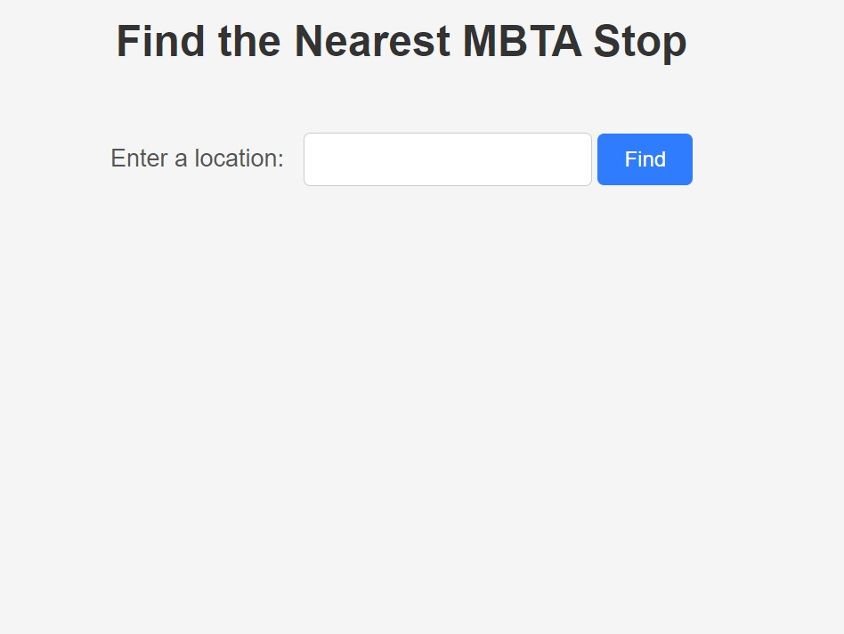
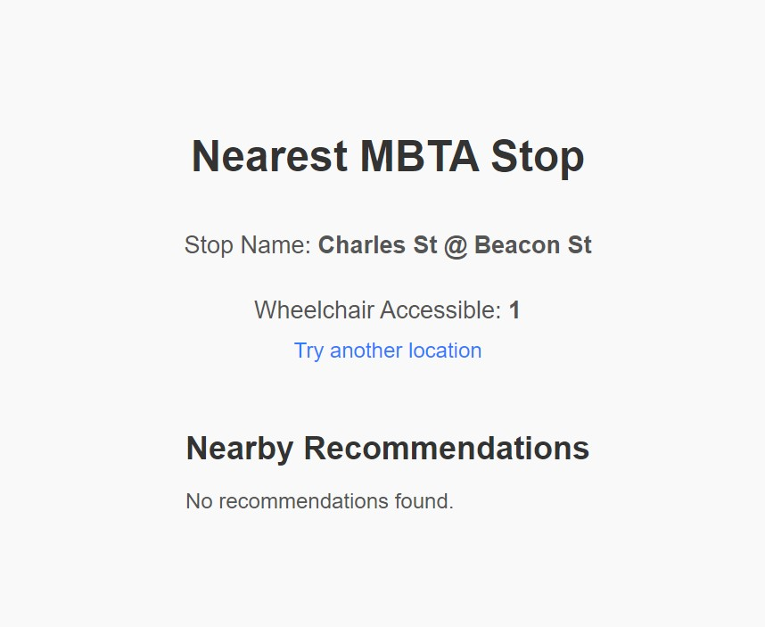

# Project Wrap-Up: MBTA HELPER

**Team Members:**
- Moises Yi

## Project Overview

Our project involved creating a web application that allows users to find the nearest MBTA (Massachusetts Bay Transportation Authority) stop to a given location. Additionally, the application leverages the Yelp API to display nearby businesses relevant to the user's location. We integrated the Mapbox API for geocoding and retrieved the nearest MBTA stop details through the MBTA API. The project extended beyond the basic requirements by integrating Yelp's business search functionality, which is still a work in progress and requires further refinement.

## Reflection 

### Process Overview

In terms of the project process, I faced both successes and areas for improvement. One of the key successes was the effective collaboration in understanding and implementing the API integrations, resulting in a fully functional web application for MBTA stops. However, the integration with the Yelp API is still a work in progress and requires further refinement.

### Work Division

Initially, I planned to divide the work based on our individual strengths, but during implementation, I found that some tasks required more collaboration than anticipated. This led to occasional confusion about task ownership and caused some bottlenecks in our progress. In the future, I will aim for a more dynamic division where team members can support each other's tasks when needed.

### Learning Perspective

From a learning perspective, this project provided valuable experience in working with multiple APIs and integrating their functionalities into a coherent web application. I gained insights into the importance of error handling and response validation when dealing with external APIs. ChatGPT assisted in understanding how to structure the code and interact with APIs, which significantly enhanced the development process.

### Future Considerations

In future projects, I aim to set clear responsibilities at the outset, allowing for more streamlined progress. Additionally, I plan to conduct thorough testing early in the development process to ensure smoother integration of individual components. This project has also highlighted the significance of thorough API documentation study prior to implementation, an aspect I will prioritize in future endeavors.

## Turning in Assignment

The complete code and updated README.md have been pushed to the forked GitHub repository under my GitHub profile. I have created a pull request to the upstream repository for review. The project's GitHub repository URL is [Insert GitHub Repository URL].

[Note: I have submitted on Canvas and added the names of all team members in the comments.]